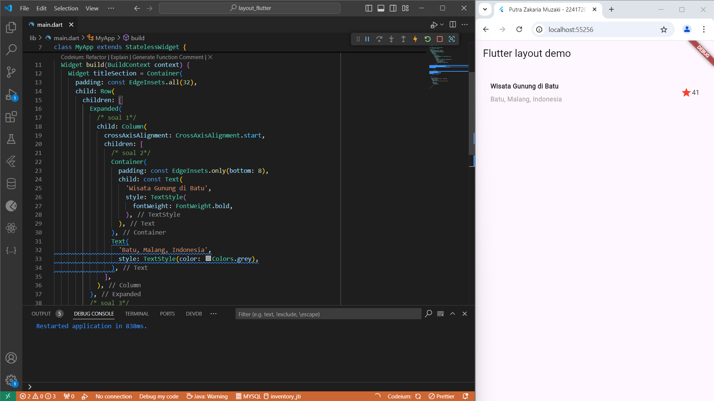
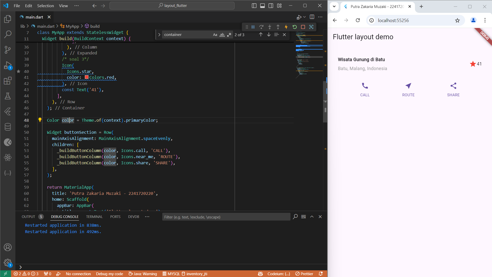
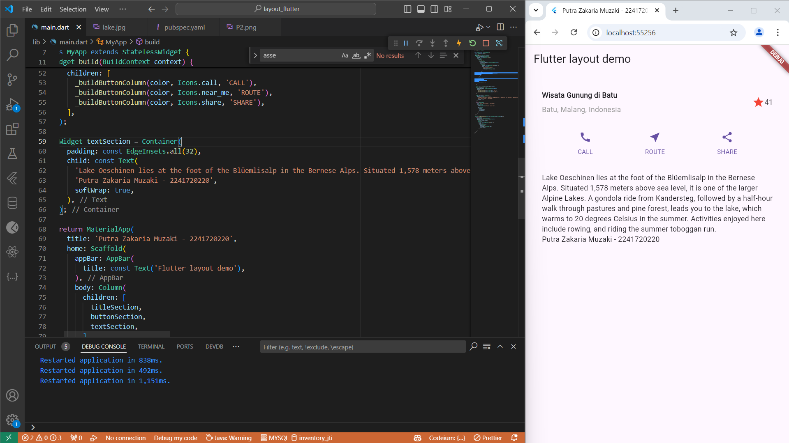
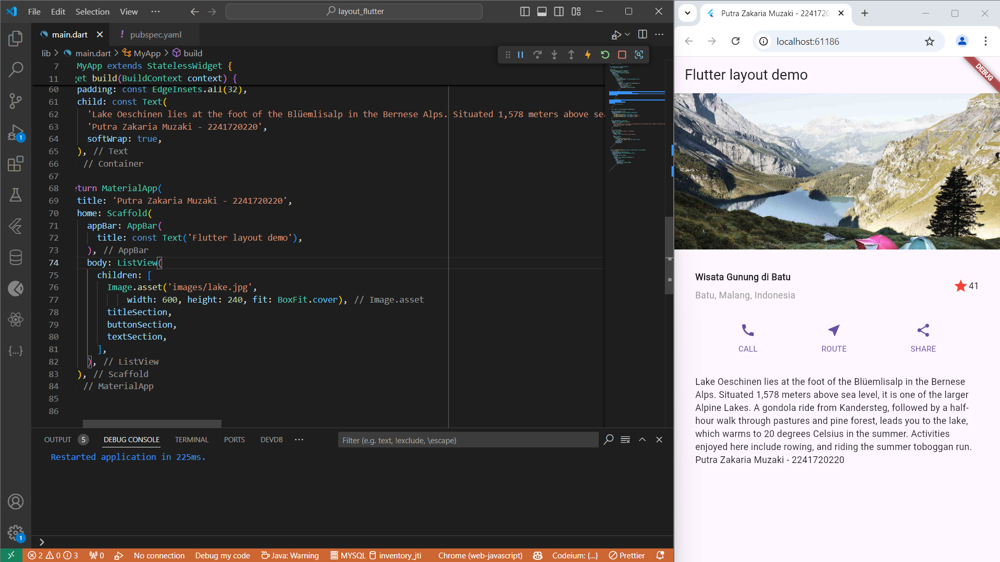

# Pemrograman Mobile Minggu 6

## Nama: Putra Zakaria Muzaki
## Kelas: TI-3H / 19
## NIM: 2241720220

 

### Praktikum 1
Pada praktikum ini membuat bagian judul menggunakan widget Container, Row, dan Column, serta menambahkan teks dan ikon

### Praktikum 2
Pada praktikum ini dilakukan proses membuat baris tombol yang berisi ikon dan teks menggunakan metode _buildButtonColumn() untuk mengatur warna dan konten setiap kolom.

### Praktikum 3
Pada praktikum ini dilakukan proses menambahkan bagian teks deskriptif dengan padding, yang menjelaskan gambar

### Praktikum 4
Di praktikum ini dilakukan proses menyiapkan gambar dengan menambahkannya ke folder images, mengonfigurasikannya di pubspec.yaml, dan menampilkannya dalam layout menggunakan ListView agar mendukung scrolling pada perangkat dengan resolusi lebih kecil

